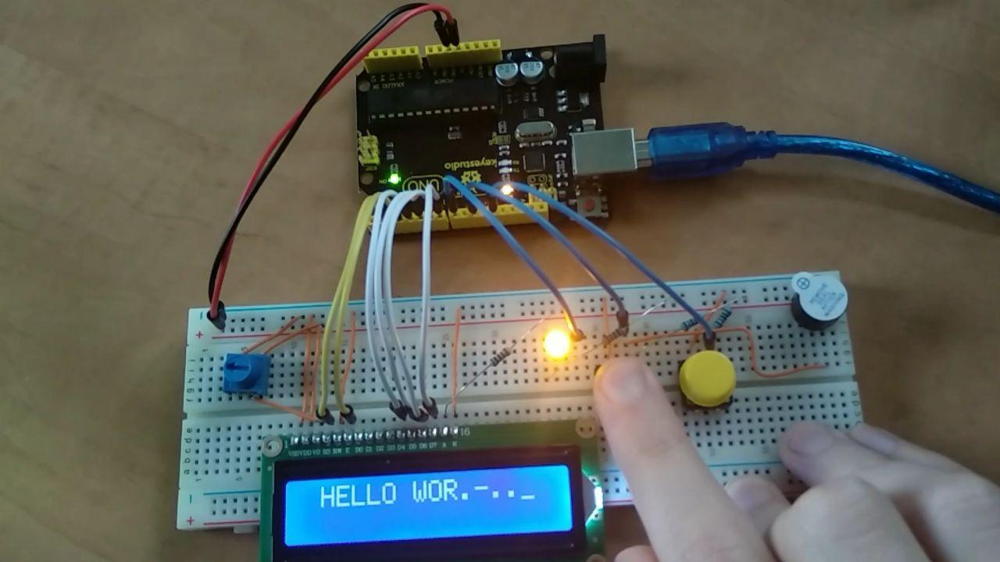

# Arduino Morse Decoder

A [Morse code](https://en.wikipedia.org/wiki/Morse_code) decoder built using

- Arduino Uno
- 16x2 LCD display
- Yellow LED
- 10KΩ potentiometer
- Active buzzer
- 2 buttons, breadboard and a lot of jumper wires

## Features

- Can decode Morse code, takes left button as an input
- Buzzer squeaks to indicate when the left button is pushed
- Outputs decoded text to an LCD display
- Right button is `Backspace`
- All inputs are debounced (as they should be)

**Dependencies**

- `arduino-cli` or an [Arduino IDE](https://www.arduino.cc/en/main/software)
- [Debouncer](https://www.arduinolibraries.info/libraries/debouncer) Arduino library

## Demo

Demo video: https://imgur.com/gallery/UQBnXUy

